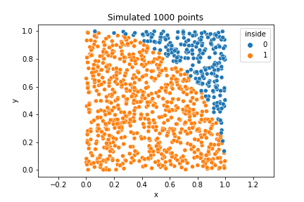
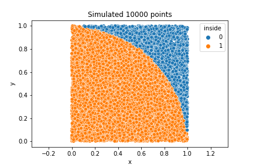
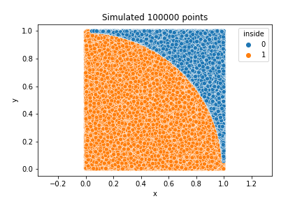
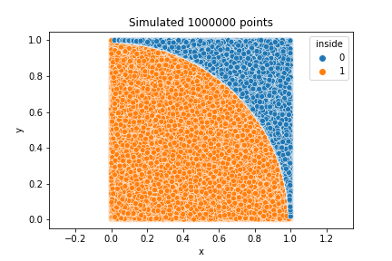
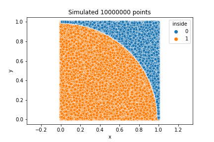

# Determine the value of pi using Monte Carlo simulation

## How it works

* Area of a circle = $\pi r^{2}$
* Imagine a square of length r. You can fit one-quarter of a circle inside
* The Monte Carlo simulation generates random points in the square
* We determine whether a point is inside or outside the quarter circle region
  * Let k = number of points that are inside the quarter circle
  * Let m = total number of points randomly created by the Monte Carlo simulation
* The ratio of the areas (quarter circle and square) are equivalent to the proportion of k and m
  * Formally, area of quarter circle / area of square = k / m
  * $\pi r^{2}$ / 4 $r^{2}$ = k / m
  * $\pi$ = 4k / m

## Results

$\pi$ is an irrational number but its value to the first 7 decimal places is 3.1415927. The estimate of $\pi$ gets closer to its true value as we increase the number of simulated points.

| Number of simulated points  | Value of $\pi$  |
|-----------------------------|-----------------|
| 1k                          | 3.08            |
| 10k                         | 3.1572          |
| 100k                        | 3.13708         |
| 1M                          | 3.14056         |
| 10M                         | 3.1412828       |

